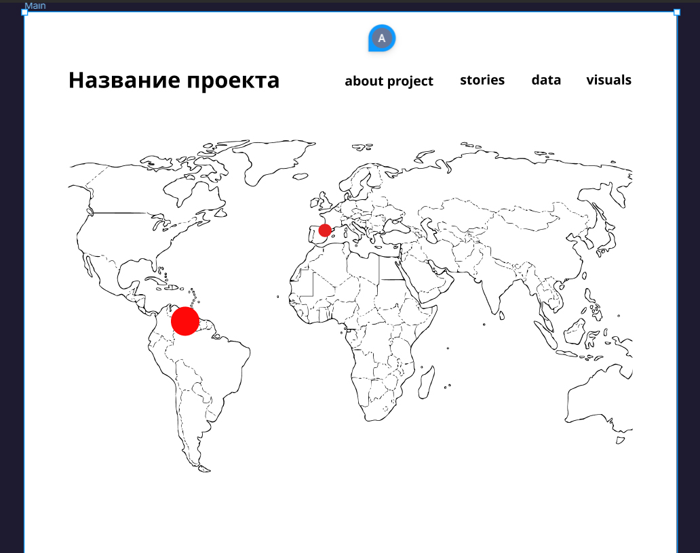

<!DOCTYPE html>
<html lang="en">
<head>
    <meta charset="UTF-8">
    <meta name="viewport" content="width=device-width, initial-scale=1.0">
    <title>Decolonization project</title>
</head>
<body>
    <h1>Decolonization project</h1>
    

    <form id="myForm">
        <label for="message">Message:</label> 
        <input type="text" id="message" name="message">  
        <button type="submit">Send Message</button>
    </form>

</body>
</html>
